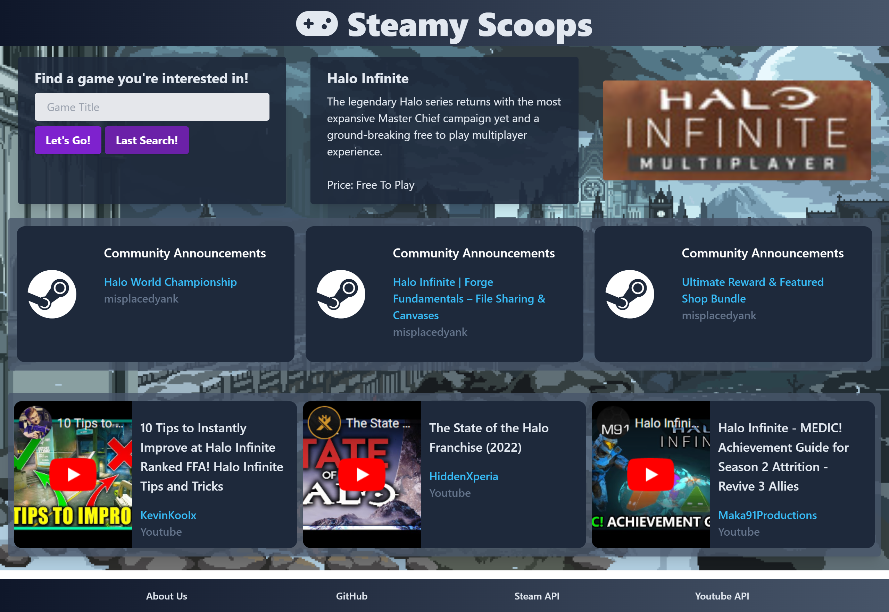

# Steamy Scoops

## Description:
This is a project that was put together to utilize two API's in order to perform a certain task. In our case, we are using a Steam API and a Youtube API in order search for a game title. After searching for the game title the project will also display things such as the games title, description, price, poster, and link to buy it on Steam. We will then utilize the Youtube API to search for the latest news regarding the searched game.

This is the first project of the Bu10 Bois. A collabration bewtween Andrew Gibbs, Mateo Wallace, Jose Leyva , & Noel Stafford using the knowledge that we have been taught so far to showcase our skills in building this project.

Together we learned to:

- Use a Kanban Board to efficiently assign and list tasks as a group
- Use multiple API's to display related information
- Troubleshoot unforeseen error in an application completely of our own creation
- Style using Tailwind CSS
- Work on the same branch as others and complete merge and pull requests

## Table of Contents

- [Installation](#installation)
- [Usage](#usage)
- [Credits](#credits)
- [License](#license)

## Installation

### Link

To use Steamy Scoops, simply navigate to [https://mateo-wallace.github.io/P1-Steamy-Scoops/](https://mateo-wallace.github.io/P1-Steamy-Scoops/)

### Display

Below you will find examples of how the web app appears at start and after one term has been searched:

## Usage

1. Click on the link to the application in [Installation](#installation).
2. On the top left you will see an input tab. Type in a Video Game. The web app will run your search and find the top Steam result. Be SPECIFIC. Sometimes the top Steam result won't be the game you wanted. *Example: Halo vs. Halo 3*
3. This will display from top to bottom: game information, game price, an image of the game as a clickable button, 3 Steam news results as clickable buttons, 3 Youtube news results as a clickable button.
4. Click on any of the hoverable displays to be directed to the article or video of your choosing.
5. Whether you refresh the page or not. The Last Search button should now call your last search by calling from local storage.

For more information please reference our [Google Slides Presentation](https://docs.google.com/presentation/d/1iWw3ddFPG-bwmLspDSL5NkOq9GdobFoOh4RRxNbCWVE/edit#slide=id.g16c67861f1b_0_25).

## Credits

### Collaborators

Andrew Gibbs: [GitHub - AndrewPGibbs](https://github.com/AndrewPGibbs)

Mateo Wallace: [GitHub - Mateo-Wallace](https://github.com/Mateo-Wallace)

Jose Leyva: [GitHub - ProNevros](https://github.com/ProNevros)

Noel Stafford: [GitHub - NoelStafford](https://github.com/NoelStafford)

### Third Party Assets

Glavier. (2022, October 5). YouTube API Documentation. RapidAPI. Retrieved October 18, 2022, from https://rapidapi.com/Glavier/api/youtube138/ 

Imgur. (2018, January 2). Only the COMFIEST pixels for you: Dark souls art. Pinterest. Retrieved October 18, 2022, from https://www.pinterest.com/pin/131589620347129803/ 

Sima, P. (2021). Steam API documentation. RapidAPI. Retrieved October 18, 2022, from https://rapidapi.com/psimavel/api/steam2 

Wathan, A. (n.d.). Rapidly build modern websites without ever leaving your HTML. Tailwind CSS. Retrieved October 18, 2022, from https://tailwindcss.com/ 

## License

MIT License

Copyright (c) 2022 Mateo Wallace

Permission is hereby granted, free of charge, to any person obtaining a copy
of this software and associated documentation files (the "Software"), to deal
in the Software without restriction, including without limitation the rights
to use, copy, modify, merge, publish, distribute, sublicense, and/or sell
copies of the Software, and to permit persons to whom the Software is
furnished to do so, subject to the following conditions:

The above copyright notice and this permission notice shall be included in all
copies or substantial portions of the Software.

THE SOFTWARE IS PROVIDED "AS IS", WITHOUT WARRANTY OF ANY KIND, EXPRESS OR
IMPLIED, INCLUDING BUT NOT LIMITED TO THE WARRANTIES OF MERCHANTABILITY,
FITNESS FOR A PARTICULAR PURPOSE AND NONINFRINGEMENT. IN NO EVENT SHALL THE
AUTHORS OR COPYRIGHT HOLDERS BE LIABLE FOR ANY CLAIM, DAMAGES OR OTHER
LIABILITY, WHETHER IN AN ACTION OF CONTRACT, TORT OR OTHERWISE, ARISING FROM,
OUT OF OR IN CONNECTION WITH THE SOFTWARE OR THE USE OR OTHER DEALINGS IN THE
SOFTWARE.

## Technology

  
  
  
  
  
  

